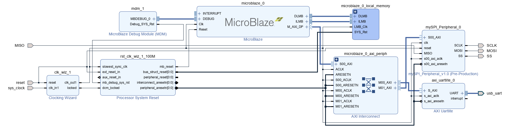

# SPI, I2C with AXI Microblaze

> **2025년 HARMAN Semicon Academy 1기** <br/> **개발기간: 2025.05.17 ~ 2025.25**

## 개발팀 소개

|박호윤                                          |박지수                                            |임윤재                                     |함영은                                      |                                                                               
| :--------------------------------------------: | :--------------------------------------------: | :---------------------------------------: | :---------------------------------------: |
|   [@cong2738](https://github.com/cong2738)     |    [@Friday930](https://github.com/Friday930)  | [@immune](https://github.com/immune1029)  | [@heyhoo46](https://github.com/heyhoo46)  |
|              I2C design & develop              |              SPI design & Simulate             |            SPI design & develop           |           I2C design & Simulate           |

## Introduce

- I2C & SPI Communication  
Learn how microcontrollers talk to peripheral devices — by actually making them talk.
This project explores I2C and SPI protocols through hands-on implementation and analysis.<br/>
**"Nothing beats learning low-level communication than writing it yourself."**<br/>
CPU가 주변 장치가 대화하는 법, 직접 구현하며 배운다.
I2C와 SPI 통신을 실습하고 분석한 프로젝트로, 하드웨어의 신호 흐름을 눈으로 보고, 손으로 느끼며 이해한다.<br/>
**"직접 하드웨어을 구현해보는 것만큼 확실한 공부법은 없다."**<br/>

## Stacks

### Environment


### Development


### Hardware

        
        


## Design

### SPI

- transmission design<br/>
            
- SPI Master ASM<br/>
            
- SPI Slave ASM<br/>
            

### I2C

- transmission design<br/>
            
- I2C Master  
    - Block Diagram<br/>
                
    - ASM FLOW<br/>
                
- I2C Slave<br/>
    - ASM  FLOW<br/>
                

## Layout, Circuit


### SPI

        
- Master device<br/>
        
- Slave device<br/>
        

### I2C

        
- Master device<br/>
        
- Slave device<br/>
    

## Circuit Output

- SPI Master LogicAnalyzer Probe<br/>
            
- I2C Master LogicAnalyzer Probe<br/>
            
            
            

## video  
- SPI, I2C<br/>
    
    <br/>  

## 디렉토리 구조

```bash
project
├── C : program demo
├── project_i2C_microblaze : I2C device block
├── project_I2C_SIMULATION : I2C Simulation(vivado SV SIM)
├── project_I2C : I2C modules
├── SPI
│   ├── 20250522_SPI_master_Slave_moudle : SPI module
│   └── 20250523_SPI_AXI_Master_MICROBLAZE : SPI device block
├── SPI_I2C_UVM : SPI Simulation(synopsys VCS SIM, verdi)
└── 발표자료
```
